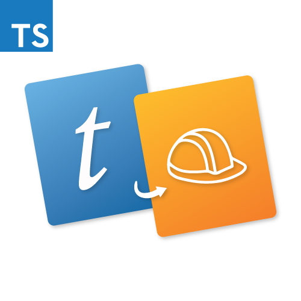
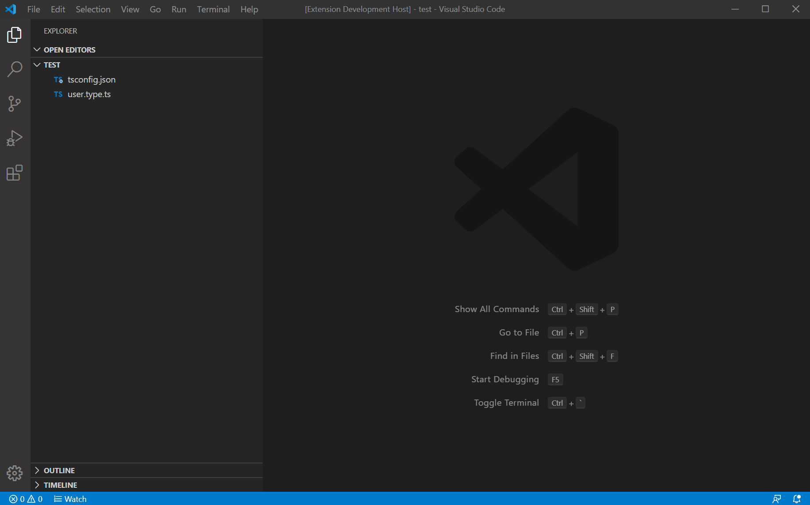

[![Travis Build Status][travis-img]][travis] [![codecov][codecov-img]][codecov] [![Dependencies Status][david-dm-img]][david-dm] [![Visual Studio Marketplace][vsmarket-img]][vsmarket]

[travis]: https://travis-ci.com/devshop/typescript-type-alias-to-builder-class
[travis-img]: https://travis-ci.com/devshop/typescript-type-alias-to-builder-class.svg?branch=master
[codecov-img]: https://codecov.io/gh/devshop/typescript-type-alias-to-builder-class/branch/master/graph/badge.svg
[codecov]: https://codecov.io/gh/devshop/typescript-type-alias-to-builder-class
[vsmarket]: https://marketplace.visualstudio.com/items?itemName=frasercrosbie.typescript-type-alias-to-builder-class
[vsmarket-img]: https://vsmarketplacebadge.apphb.com/version/frasercrosbie.typescript-type-alias-to-builder-class.svg
[david-dm]: https://david-dm.org/devshop/typescript-type-alias-to-builder-class?type=dev
[david-dm-img]: https://david-dm.org/devshop/typescript-type-alias-to-builder-class/dev-status.svg



# TypeScript Type Alias to Builder Class

TypeScript Type Alias to Builder Class is a Visual Studio Code extension that will save you time by automatically generating a builder class from a TypeScript type alias.

[Visual Studio Marketplace Page](https://marketplace.visualstudio.com/items?itemName=FraserCrosbie.typescript-type-alias-to-builder-class)

## Features

Stop wasting time manually writing out builder classes. Use this extension to instantly generate a builder from a type alias.



The generated file will be in the same folder as your type alias file.

If you're not already using builders, you should start. They are a great way to easily generate data for your unit tests.

If you are using this extension and find any issues or wish to add improvements, feel free to [contribute](https://github.com/devshop/typescript-type-alias-to-builder-class).

## Example

Here is an example of using the generated builder to create a user for a test scenario.

Start with an type alias file that you have written.

**user.type.ts**

```
export type User = {
  firstName: string
  lastName: string
  email: string
  age: number
}
```

Run the extension `Cmd/Ctrl + Shift + P => Generate Builder Class From TypeScript Type Alias`.

Manually update the generated file to take care of any required imports and to set the default values.

To create a new user with the default values defined in the builder class use the following code.

```
const user: User = new UserBuilder().build()
```

If you want to override the default values you can specify unique values using `.with<PropertyName>(value)`.

```
const user: User = new UserBuilder()
  .withFirstName('Bruce')
  .withLastName('Wayne')
  .withEmail('bruce.wayne@wayne-enterprises.com')
  .WithAge(48)
  .build()
```

## Requirements

To use the extension:

- You must have a folder open in Visual Studio Code
- You must have a type alias file open
- Your type alias must include the text `export type`
- You need to have at least one property defined with a data type e.g. `firstName: string`

## Known Issues

- Any required imports will have to be added manually after the builder is generated.
- If your property has an [Advanced Type](https://www.typescriptlang.org/docs/handbook/advanced-types.html) e.g. `foo: keyof Foo` the initial value will be `undefined` which will not compile unless the property is optional. These values will need to manually entered.
- If you have methods defined in your type alias the builder will not be generated.
